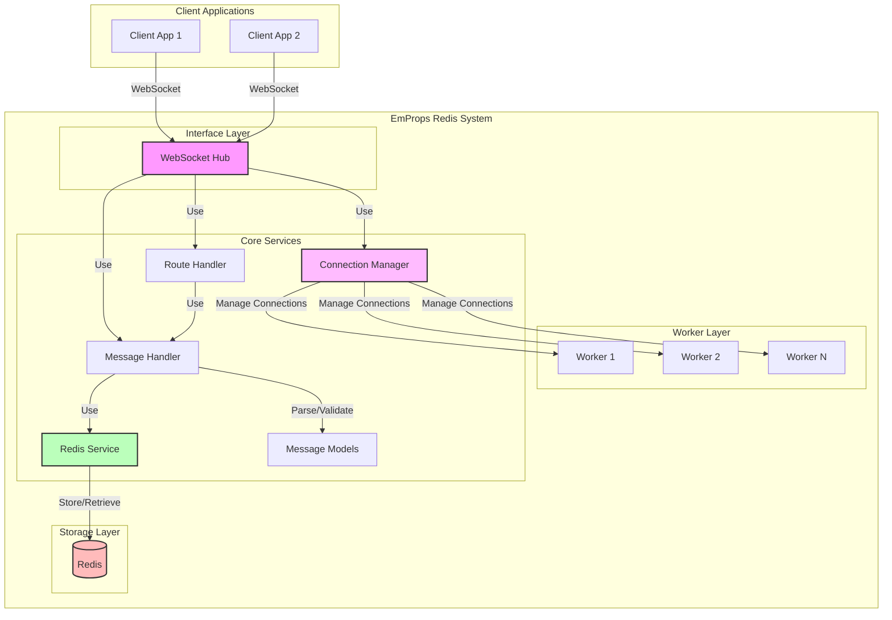
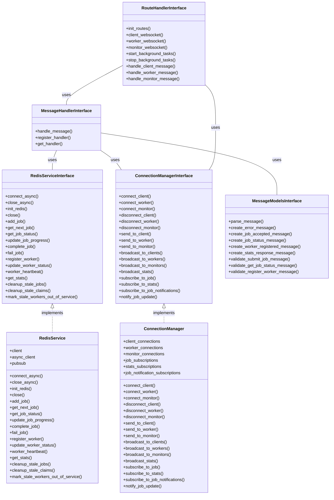
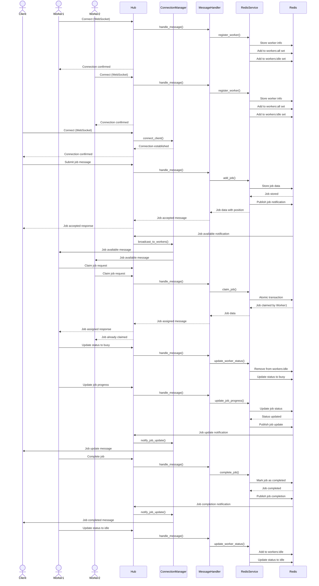
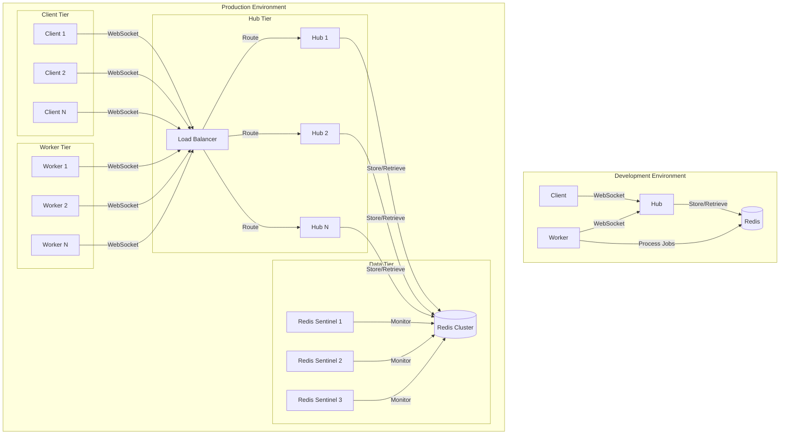
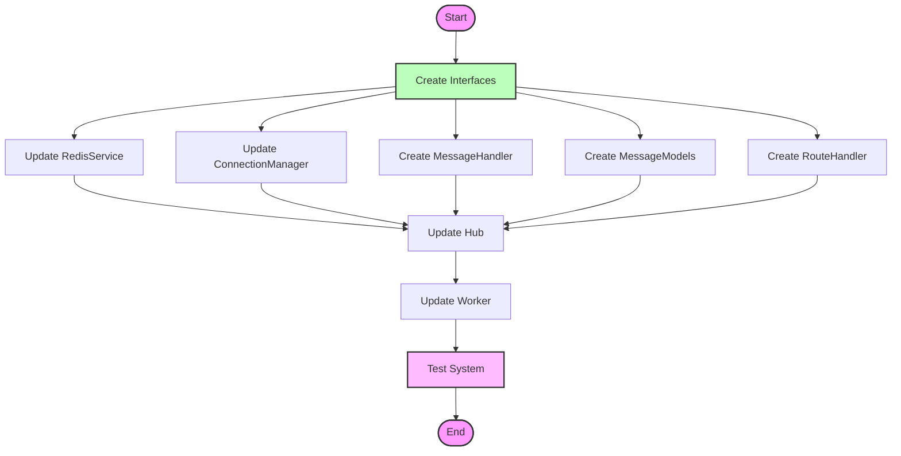

# EmProps Redis Architecture

This document provides an overview of the EmProps Redis system architecture, including the interfaces, components, and their interactions.

## System Overview

The EmProps Redis system is a distributed job queue system that uses Redis as a backend. It consists of several components:

1. **Hub**: The central WebSocket server that manages connections, routes messages, and provides the client interface
2. **Worker**: A service that processes jobs from the queue
3. **Redis**: The backend storage and message broker

## Component Architecture

<FullscreenDiagram>

</FullscreenDiagram>

## Interface Architecture

The system is built around a set of interfaces that define the contracts between components:

<FullscreenDiagram>

</FullscreenDiagram>

## Message Flow

The following diagram illustrates how messages flow through the system:

<FullscreenDiagram>

</FullscreenDiagram>

## System Deployment

The system can be deployed in various configurations:

<FullscreenDiagram>

</FullscreenDiagram>

## Refactoring Plan

The refactoring plan involves the following steps:

<FullscreenDiagram>

</FullscreenDiagram>
