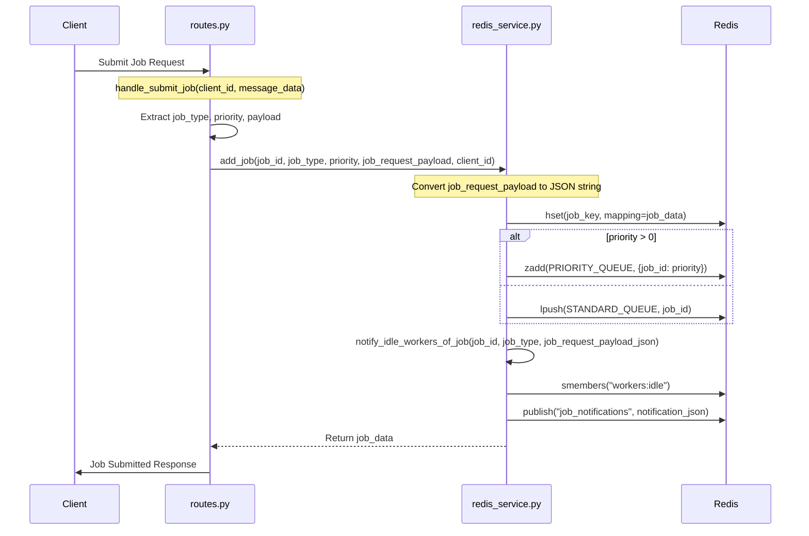
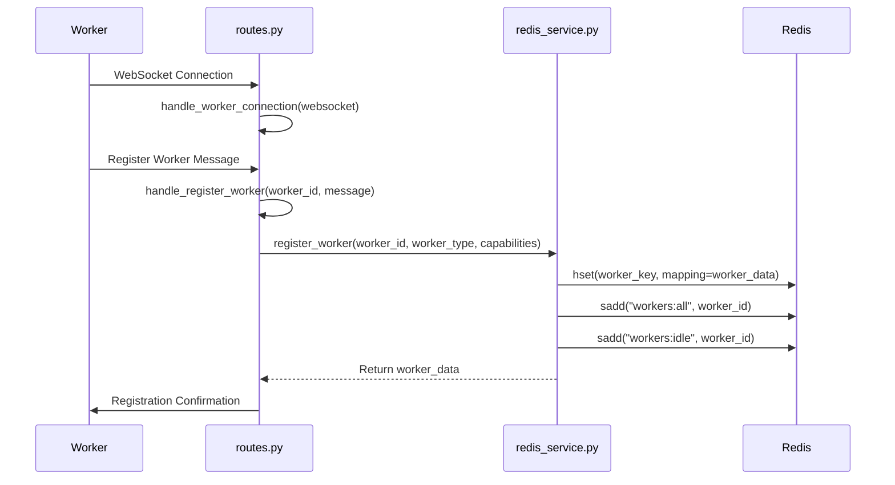
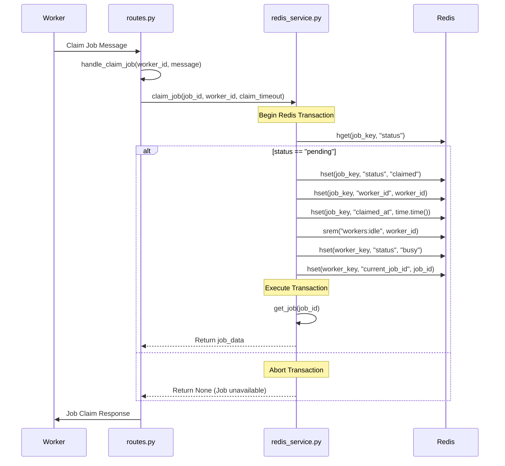
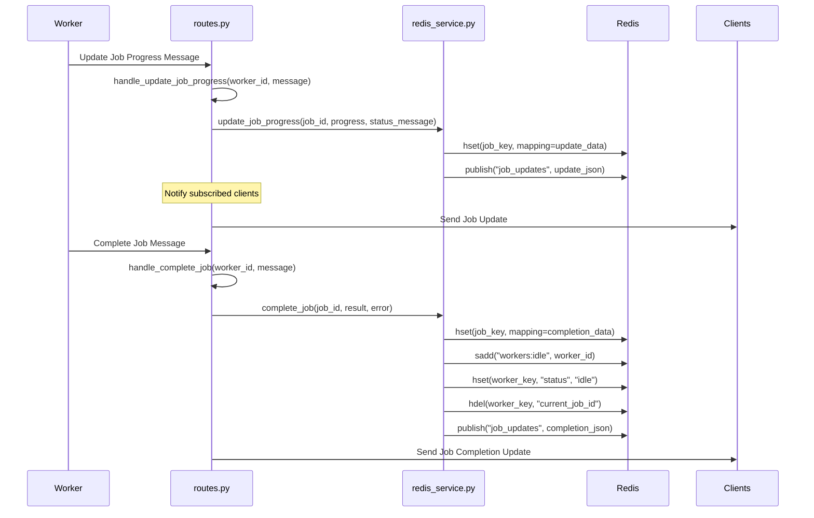
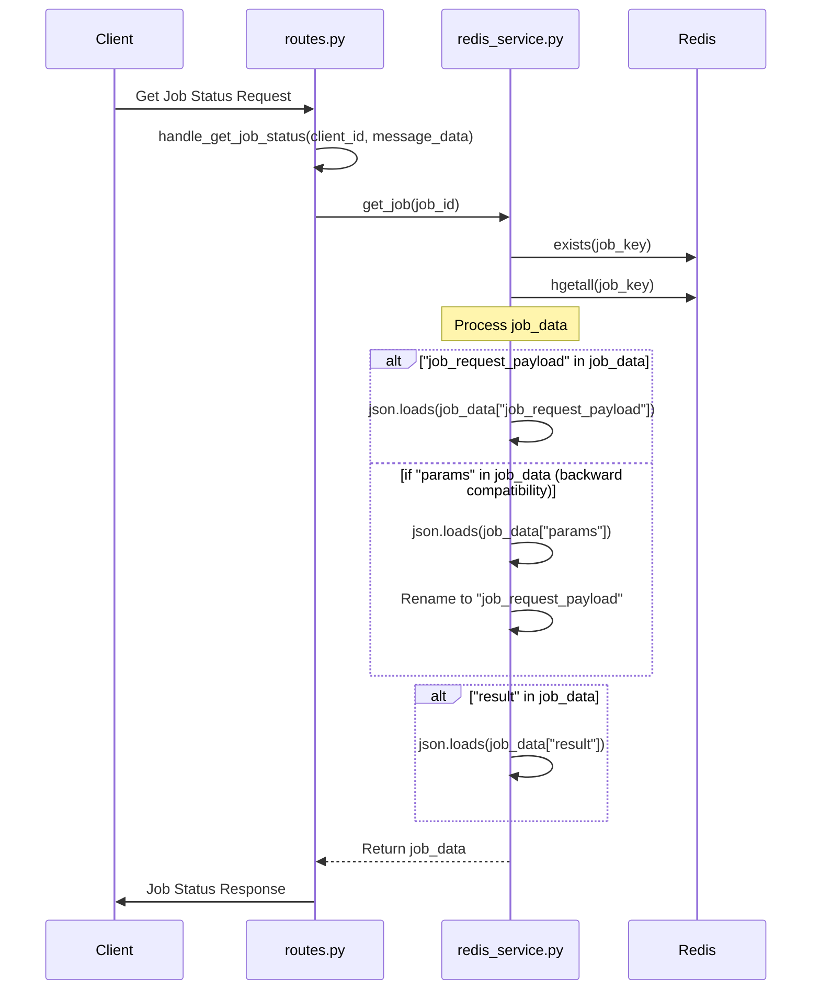
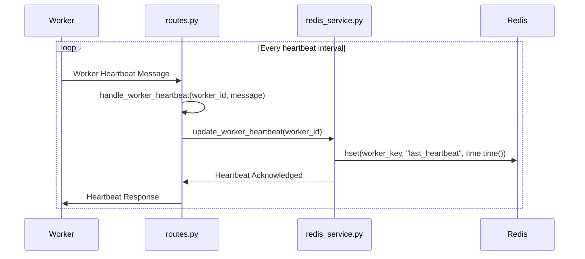
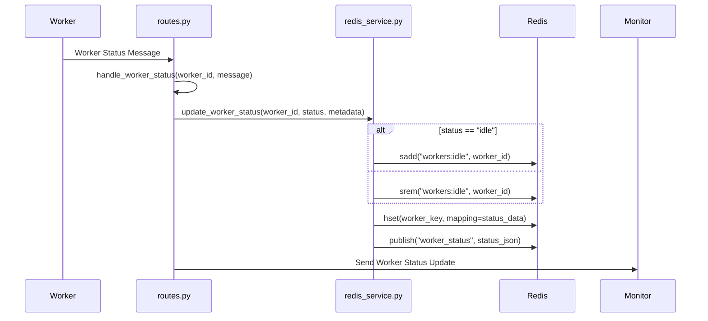
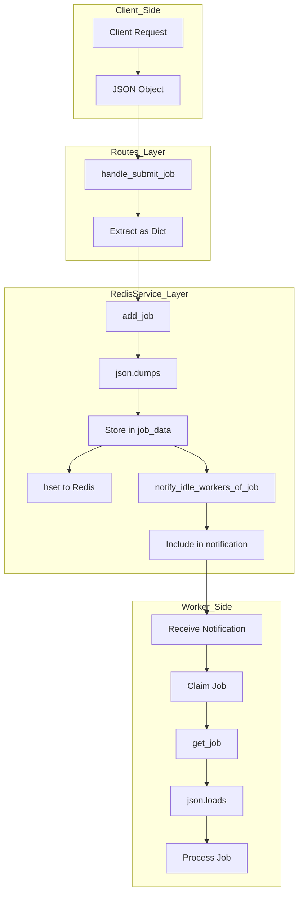
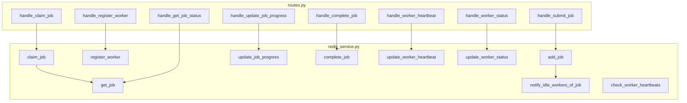

# Function-Level Process Flow

This document provides a detailed function-level view of how job data flows through the EMP Redis system.

## Job Submission Process

## Worker Registration Process

## Job Claiming Process

## Job Processing Flow

## Job Retrieval Process

## Worker Heartbeat Process

## Worker Status Management

## Job Request Payload Data Flow

## Function Call Dependencies

## Proposed Optimized Job Request Payload Flow

```mermaid
flowchart TD
    subgraph Current_Implementation
        A1[Client Request] --> A2[Python Dict in routes.py]
        A2 --> A3[add_job receives Dict]
        A3 --> A4[json.dumps in add_job]
        A4 --> A5[Store JSON String in Redis]
        A5 --> A6[get_job retrieves String]
        A6 --> A7[json.loads in get_job]
        A7 --> A8[Return Dict to caller]
    end
    
    subgraph Optimized_Implementation
        B1[Client Request] --> B2[Python Dict in routes.py]
        B2 --> B3[add_job accepts Dict or String]
        
        B3 -->|If Dict| B4[json.dumps in add_job]
        B3 -->|If String| B5[Validate JSON in add_job]
        
        B4 --> B6[Store JSON String in Redis]
        B5 --> B6
        
        B6 --> B7[get_job retrieves String]
        B7 --> B8[Return String to caller]
        B8 --> B9[Caller parses only when needed]
    end
```

This documentation provides a detailed view of how the different functions in the system interact, showing the complete flow of job data and control through the various components.
