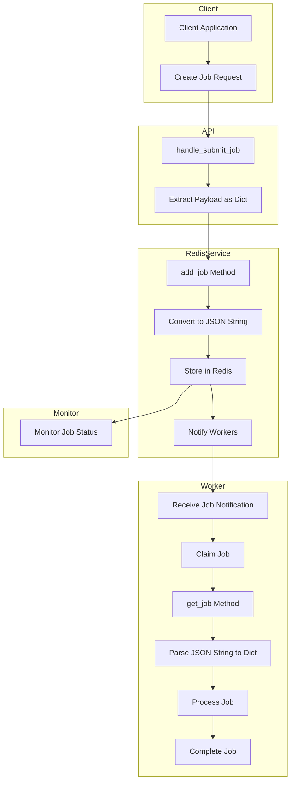
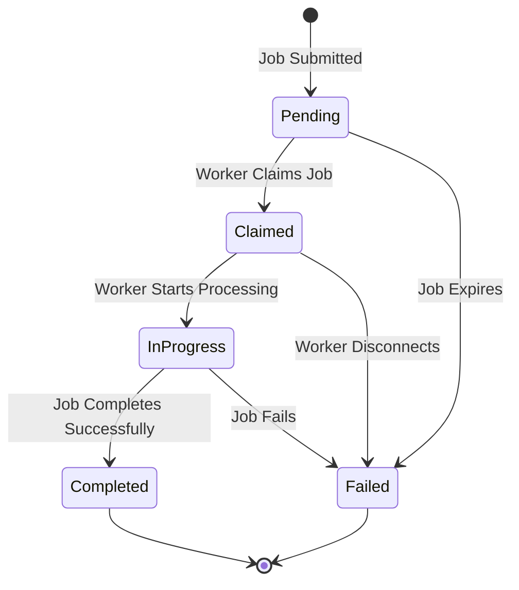
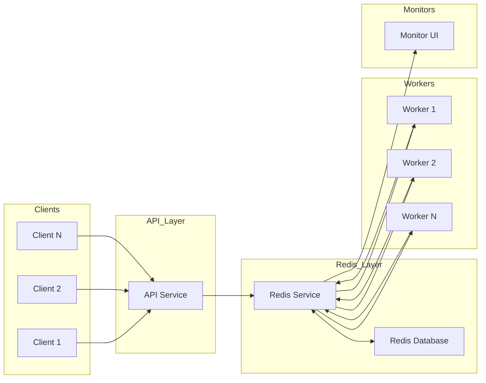
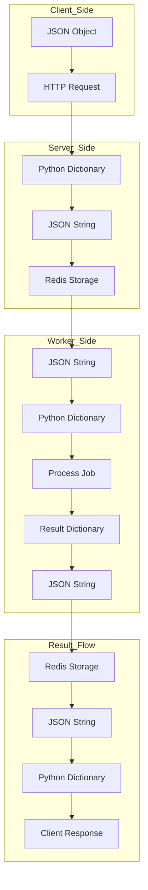
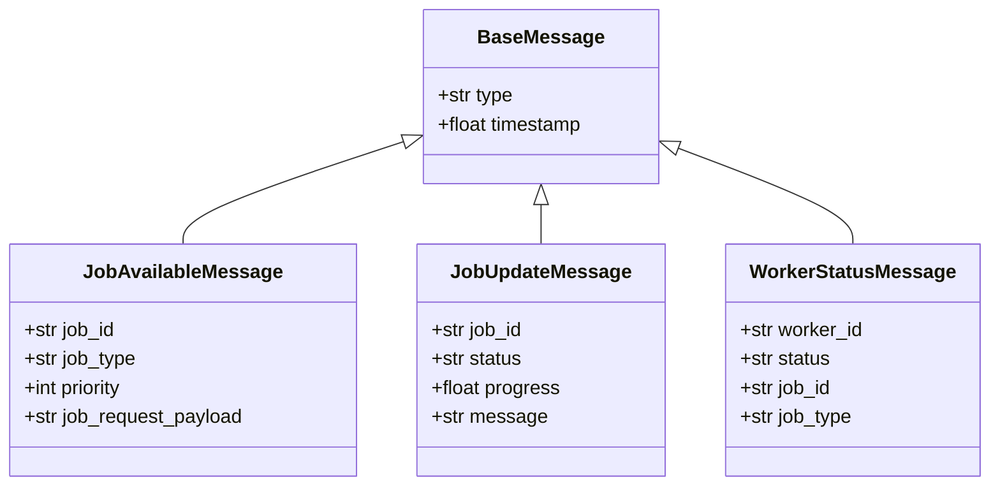

# Job Processing Flow Diagram

This document outlines the flow of job requests and data through the EMP Redis system.

## Job Request Payload Flow

## Job Lifecycle State Diagram

## System Architecture

## Data Transformation Flow

## Proposed Optimization

```mermaid
flowchart TD
    subgraph Current_Flow
        A1[Client Request] --> A2[Python Dict]
        A2 --> A3[JSON String]
        A3 --> A4[Redis Storage]
        A4 --> A5[JSON String]
        A5 --> A6[Python Dict]
        A6 --> A7[Worker Processing]
    end
    
    subgraph Optimized_Flow
        B1[Client Request] --> B2[Python Dict]
        B2 --> B3[JSON String]
        B3 --> B4[Redis Storage]
        B4 --> B5[JSON String]
        B5 --> B6[Worker Processing]
        
        B2 -.-> |"Skip if already string"| B3
        B5 -.-> |"Parse only when needed"| B6
    end
```

## Message Structure

This documentation provides a comprehensive view of how job data flows through the system, from client submission to worker processing and result delivery.
